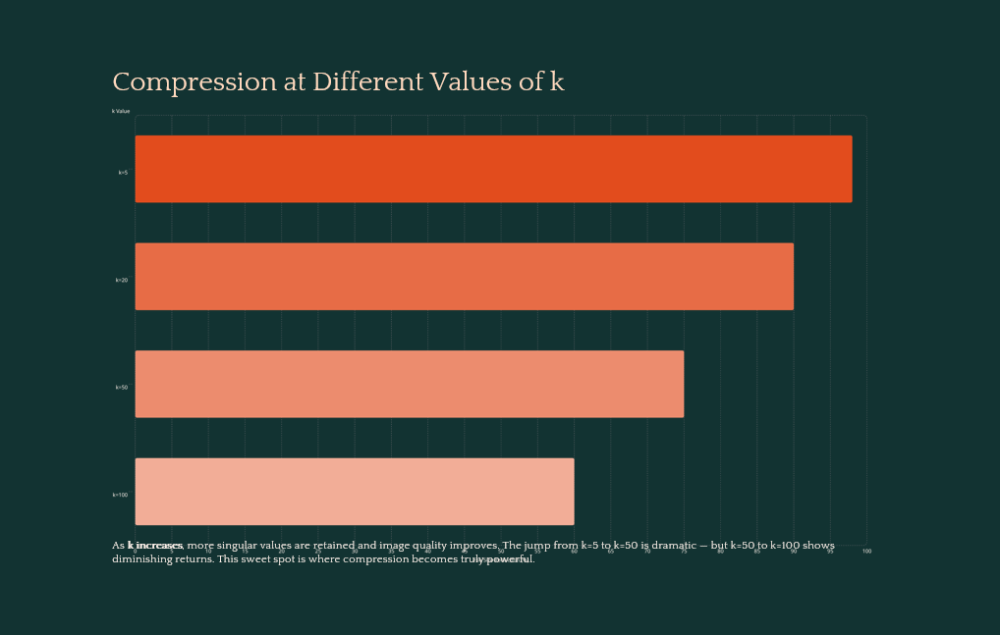
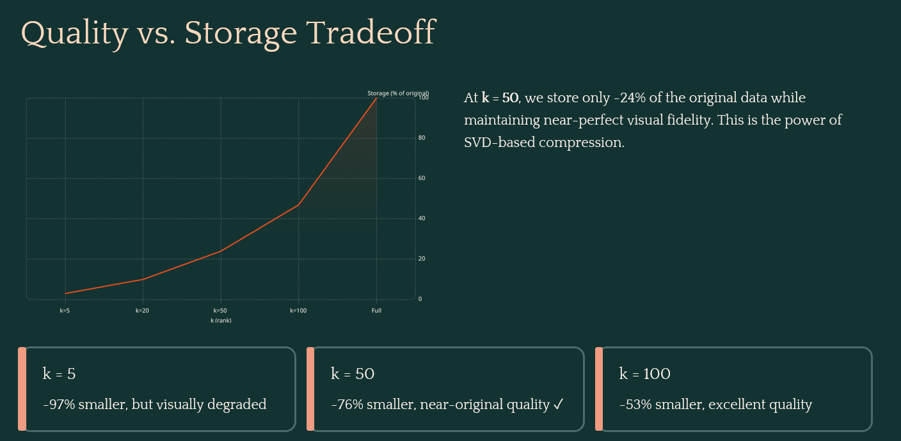

# 🖼️ Image Compression using SVD (Singular Value Decomposition)

## 📌 Overview
This project demonstrates how **Singular Value Decomposition (SVD)** can be used for **image compression**. The idea is to reduce the amount of data required to represent an image while maintaining acceptable visual quality.

By keeping only the most important singular values, we can reconstruct an approximation of the original image with significantly reduced storage.

---

## 🧠 Concept Behind the Project

An image can be represented as a matrix of pixel values. Using SVD, any matrix **A** can be decomposed into:

A = U × S × Vᵀ

- **U** → Left singular vectors  
- **S** → Singular values (importance of features)  
- **Vᵀ** → Right singular vectors  

Instead of keeping all singular values, we retain only the top **k** values:
- Smaller **k** → More compression, lower quality  
- Larger **k** → Less compression, higher quality  

---

## ⚙️ Features

- Compresses images using SVD
- Works on RGB images (splits into R, G, B channels)
- Allows multiple compression levels using different **k values**
- Visual comparison between original and compressed images
- Simple and easy-to-understand implementation

---

## 🛠️ Technologies Used

- Python
- NumPy (for matrix operations)
- OpenCV (for image handling)
- Matplotlib (for visualization)

---

## 🚀 How It Works

1. Load the image using OpenCV  
2. Convert image from BGR to RGB format  
3. Normalize pixel values (0 to 1)  
4. Split image into Red, Green, and Blue channels  
5. Apply SVD on each channel separately  
6. Keep only top **k singular values**  
7. Reconstruct compressed image  
8. Combine RGB channels back  
9. Display results using Matplotlib  

---

## 📊 Compression Levels

The project uses the following **k values**:

- k = 5 → High compression, low quality  
- k = 20 → Moderate compression  
- k = 50 → Better quality  
- k = 100 → Near-original quality  




---

## ▶️ How to Run

### Step 1: Install Dependencies

```
pip install numpy opencv-python matplotlib
```

### Step 2: Run the Script

```
python imgcomp.py
```

---

## 📸 Output
- Displays original image
- Shows compressed versions with different k values
- Helps visually understand quality vs compression trade-off